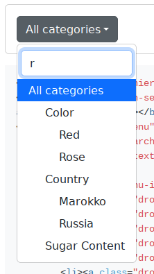

# Hierarchy Select jQuery Plugin for Twitter Bootstrap 5

[](https://travis-ci.com/NeoFusion/hierarchy-select)

## What is it

The "Hierarchy Select" is a jQuery plugin for Bootstrap CSS to make select dropdown with search box.
It comes with built-in search feature to search from select list. 
You just need to define a list of words, then this plugin will do everything.

The plugin also useful to create multilevel tree view select dropdowns.



## How to add hierarchy-select into your webpage

1. First of all load jQuery and Bootstrap framework into your webpage. 

```html
<!-- Bootstrap CSS -->
<link href="https://cdn.jsdelivr.net/npm/bootstrap@5.2.1/dist/css/bootstrap.min.css" rel="stylesheet" integrity="sha384-iYQeCzEYFbKjA/T2uDLTpkwGzCiq6soy8tYaI1GyVh/UjpbCx/TYkiZhlZB6+fzT" crossorigin="anonymous">


<!-- jQuery -->
<script src="https://code.jquery.com/jquery-3.6.0.slim.min.js" integrity="sha256-u7e5khyithlIdTpu22PHhENmPcRdFiHRjhAuHcs05RI=" crossorigin="anonymous"></script>

<!-- Bootstrap JavaScript -->
<script src="https://cdn.jsdelivr.net/npm/bootstrap@5.2.1/dist/js/bootstrap.bundle.min.js" integrity="sha384-u1OknCvxWvY5kfmNBILK2hRnQC3Pr17a+RTT6rIHI7NnikvbZlHgTPOOmMi466C8" crossorigin="anonymous"></script>
```

2. Now, also include Hierarchy Select‘s CSS and JavaScript file.

```html
<link rel="stylesheet" href="css/hierarchy-select.min.css">
<script src="dist/hierarchy-select.min.js"></script>
```

3. After loading all necessary assets, create HTML structure for select dropdown as follows:

```html
<div class='dropdown hierarchy-select' id='example-one'>
    <button class="btn btn-secondary dropdown-toggle" type="button" id="dropdownMenuButton1" data-bs-toggle="dropdown"
    aria-expanded="false"></button>
    <ul class="dropdown-menu" aria-labelledby="dropdownMenuButton1">
        <div class="hs-searchbox">
            <input type="text" class="form-control" autocomplete="off">
        </div>
        <div class='hs-menu-inner'>
            <li><a class="dropdown-item" data-value="" data-level="1" data-default-selected="" href="#">All categories</a></li>
            <li><a class="dropdown-item" data-value="1" data-level="1" href="#">Wine</a></li>
            <li><a class="dropdown-item" data-value="2" data-level="2" href="#">Color</a></li>
            <li><a class="dropdown-item" data-value="3" data-level="3" href="#">Red</a></li>
            <li><a class="dropdown-item" data-value="4" data-level="3" href="#">White</a></li>
            <li><a class="dropdown-item" data-value="5" data-level="3" href="#">Rose</a></li>
            <li><a class="dropdown-item" data-value="6" data-level="2" href="#">Country</a></li>
            <li><a class="dropdown-item" data-value="7" data-level="3" href="#">Marokko</a></li>
            <li><a class="dropdown-item" data-value="8" data-level="3" href="#">Russia</a></li>
            <li><a class="dropdown-item" data-value="9" data-level="2" href="#">Sugar Content</a></li>
            <li><a class="dropdown-item" data-value="10" data-level="3" href="#">Semi Sweet</a></li>
            <li><a class="dropdown-item" data-value="11" data-level="3" href="#">Brut</a></li>
            <li><a class="dropdown-item" data-value="12" data-level="2" href="#">Rating</a></li>
            <li><a class="dropdown-item" data-value="13" data-level="2" href="#">Grape Sort</a></li>
            <li><a class="dropdown-item" data-value="14" data-level="3" href="#">Riesling</a></li>
            <li><a class="dropdown-item" data-value="15" data-level="3" href="#">Aleatico</a></li>
            <li><a class="dropdown-item" data-value="16" data-level="3" href="#">Bouchet</a></li>
            <li><a class="dropdown-item" data-value="17" data-level="1" href="#">Whiskey</a></li>
            <li><a class="dropdown-item" data-value="18" data-level="2" href="#">Country</a></li>
            <li><a class="dropdown-item" data-value="19" data-level="3" href="#">Ireland</a></li>
            <li><a class="dropdown-item" data-value="20" data-level="3" href="#">Kanada</a></li>
            <li><a class="dropdown-item" data-value="21" data-level="3" href="#">Scotland</a></li>
        </div>
    </ul>
    <input class="d-none" name="example_one" readonly="readonly" aria-hidden="true" type="text"/>
</div>
```

4. Finally, initialize the plugin in jQuery document ready function to active Bootstrap select dropdown with search. 

```javascript
$('#example-one').hierarchySelect({
    width: 'auto'
});
```

For more examples, see: [docs/index.html](docs/index.html)

## Advance Configuration Options for Bootstrap Select with Search 

The following are some advance configuration options to create Bootstrap select with search.

<table>
<tr>
<td> Option </td>
<td> Description </td>
</tr>
<tr>
<td> width </td>
<td> It define the CSS width property for select element.
Default:  `auto`, Type: `String`.

EXAMPLE:

```javascript
$('#example').hierarchySelect({
	width: 'auto'
});
```
</td>
</tr>
<tr>
<td> height </td>
<td> Define the CSS height property for select dropdown list. 
Default: `256px`, Type: `String`.

EXAMPLE:

```javascript
$('#example').hierarchySelect({
	height: '256px'
});
```
</td>
<tr>
<td>hierarchy </td>
<td> Decide weather to make your dropdown list hierarchy (tree view).
Default: `true`, Type: `Boolean`.

EXAMPLE:

```javascript
$('#example').hierarchySelect({
	hierarchy: false
});
```
</td>
</tr>
<tr>
<td>search</td>
<td> Enable / disable search functionality in select dropdown.
Default: `true`, Type: `Boolean`.

EXAMPLE:

```javascript
$('#example').hierarchySelect({
	search: true
});
```
</td>
</tr>
</table>


## How to build 

Run in command line:

```bash
git clone git@github.com:NeoFusion/hierarchy-select.git
cd hierarchy-select
npm install
grunt 
```

## For old Bootstrap versions

For Bootstrap 4 use [version 2.x](https://github.com/NeoFusion/hierarchy-select/tree/v2).

For Bootstrap 3 use [version 1.x](https://github.com/NeoFusion/hierarchy-select/tree/v1).
